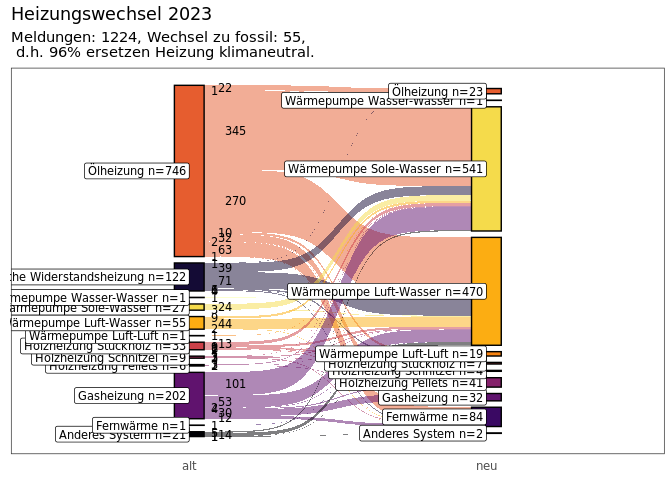

<!-- README.md is generated from README.Rmd. Please edit that file -->

# heizPack

<!-- badges: start -->
<!-- badges: end -->

The goal of heizPack is to illustrate changes in the heating system

## Installation

You can install the development version of heizPack from
[GitHub](https://github.com/) with:

``` r
# install.packages("devtools")
devtools::install_github("sommer-tobias/heizPack")
```

## Example

This shows how execute the basic function of the package:

``` r
library(heizPack)
sankeyEnergiemeldungen(2023)
#> Joining with `by = join_by(x, node, next_x, next_node, n)`
#> Joining with `by = join_by(x, node, next_x, next_node, n)`
#> Joining with `by = join_by(x, node, next_x, next_node, n)`
#> Joining with `by = join_by(x, node)`
```


